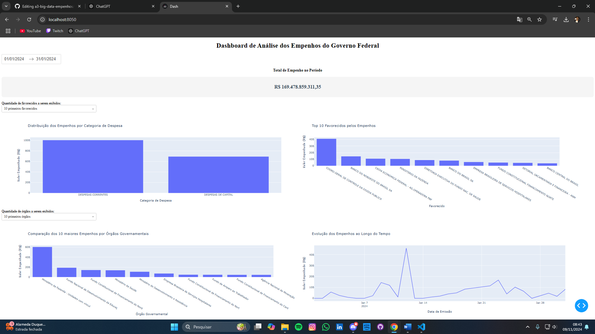

# A3 Big data - Empenhos

# Dashboard de Análise dos Empenhos do Governo Federal - Janeiro de 2024

Este projeto tem como objetivo criar um dashboard interativo para analisar os dados de empenhos do governo federal no mês de janeiro de 2024. Utilizando ferramentas de visualização de dados, o dashboard apresenta quatro gráficos que permitem uma análise detalhada dos valores empenhados.

## Ferramentas Utilizadas

- **Python 3.x**: Linguagem de programação utilizada para processar os dados e gerar os gráficos.
- **Bibliotecas Python**:
  - `pandas`: Para a manipulação e limpeza de dados.
  - `matplotlib` e `seaborn`: Para criar os gráficos estáticos.
  - `plotly`: Para gráficos interativos.
- **Portal da Transparência**: Fonte de dados utilizada para os empenhos do governo federal (Janeiro de 2024).

## Estrutura do Projeto

- `assets/nome-planilha.xlsx`: Contém os dados extraídos do Portal da Transparência;
- `assets/enunciado.docx`: Contém o enunciado do exercício;
- `assets/mapeamento.json`: Mapeamento de estrutura do banco banco, para que ao importar os dados o python consiga fazer o de/para dos ados não estruturados para estruturados;
- `src/db_connection.py`: Arquivo de conexão, que pega os dados de forma inamica pelo arquivo .env;
- `src/importador-dados.py`: Contém o script Python que processam os dados, jogando para estrutura do banco de dados;
- `src/empenhos-dashboard.py`: Programa python que gera o dashboard com os gráficos que mostram os dados de empenho;
- `requirements/`: Arquivo que indica as bibliotecas necessárias para execução do projeto;
- `.env.template`: Aquivo de dados que são parametrizados no projeto, deve se criar a partir desse template o arquivo .env oficial;
  
## Passo a Passo para Execução

### 1. Instalar Dependências

Antes de executar o projeto, certifique-se de ter as bibliotecas necessárias instaladas. Você pode fazer isso rodando o seguinte comando no terminal, que instala as dependências listadas no arquivo `requirements.txt`:

```bash
pip install -r requirements.txt
```

As bibliotecas incluem:

- **pandas:** Para manipulação de dados.
- **matplotlib e seaborn**: Para criação dos gráficos estáticos.
- **plotly:** Para gráficos interativos e visualização dinâmica.

### 2. Obtenção dos Dados

Os dados de empenhos foram extraídos diretamente do Portal da Transparência, especificamente a base de dados de despesas federais para janeiro de 2024. Os dados já estão disponíveis no diretório assets/ para facilitar o processo de análise. Além disso, o dicionário de dados que explica cada coluna da base pode ser consultado aqui.
https://portaldatransparencia.gov.br/pagina-interna/605513-dicionario-de-dados-empenho.

- **Executar o seguinte script de criação de banco e dados:** SQL - Criação do banco de empenhos.sql

- **Anexar a planilha dos dados** colocar em /assets e configurar os caminhos e conexão com o banco no arquivo .env

### 3. Preparação dos Dados

Os dados brutos precisam ser preparados antes de serem visualizados. No script src/importador-dados.py, é processado os dados a planilha e 
jogados para a estrutura de banco de dados criado no passo anterior:

```bash
python src/importador-dados.py
```

### 4. Geração dos Gráficos

Os gráficos são gerados através do script src/empenhos-dashboard.py. Os cinco gráficos são:

- **Valor total dos empenhos no período selecionado:** gráfico que nostra o valor em reais total entre as datas selecionadas

- **Distribuição por categoria econômica:** gráfico de barras que mostra a distribuição dos empenhos por categoria econômica;

- **Análise dos maiores beneficiários dos empenhos:** gráfico de barras, exibindo os maiores beneficiários de empenhos;

- **Comparação por órgão governamental:** gráfico de barras comparando os valores empenhados por diferentes órgãos do governo;

- **Evolução dos valores empenhados ao longo do mês:** gráfico de linha mostrando a evolução dos valores empenhados ao longo do mês de janeiro de 2024.

Para rodar o dashboard, execute:

```bash
python src/empenhos-dashboard.py
```

acessar na url: http://localhost:8050/

OBS: dá para personalizar a exibição através de 3 inputs:
- input da datas entre um período;
- input de top favoreciddos;
- input de top órgãos governamentais.

Conclusão:
- Criação do banco de empenhos;
- Anexo da planilha de empenhos;
- Importação dos dados da planilha para o banco;
- Geração do dashboard para exibição de gráficos.

## **Exemplo de como é o dashboard:**


